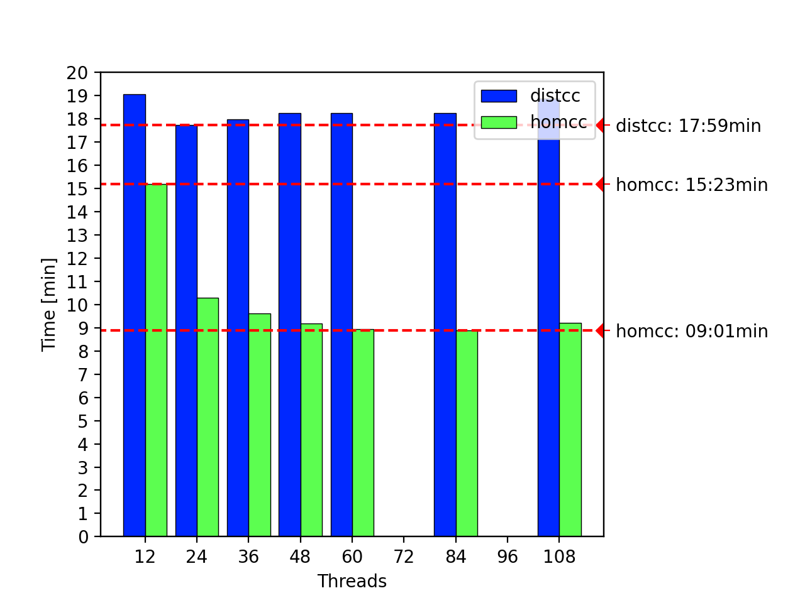

# :house_with_garden: HOMCC - Work From Home friendly distcc replacement

`HOMCC`, pronounced `həʊm siː siː`, is a work from home oriented, compilation distribution project which keeps the premise of always generating the same results as a local build.
Current supported languages are `C` and `C++` with their respective `gcc` and `clang` compilers.

While distributing compilations generally improves build times of large code bases, narrow network bandwidths pose a crucial limiting factor.
This project's primary goal is to find approaches to mitigate this bottleneck.
Compared to `distcc`, `HOMCC` provides compilation times smaller by some orders of magnitudes for connections with a small uplink:
<p align="center">
  
  <br/>
  <sub>
  Difference in total remote compilation times for a <a href="https://github.com/celonis/">Celonis</a> internal C++ code base built with <code>clang++-14</code>, a total server job limit of 112 and 60 compilation threads.
  </sub>
</p>

The main solution to enable faster compilation times for thinner connections is the compression and `server`-side caching of dependencies.
Due to caching, only missing dependencies are requested from `client`s which drastically decreases the overall network traffic once the cache is warmed up.
Transmitted files like the requested dependencies and also the resulting object files are compressed to further improve build times.
Additionally, `HOMCC` provides sandboxed compiler execution for remote compilations via `schroot` and `docker`.

---

## Table of Contents
1. [Installation](#installation)
2. [Usage](#usage)
   1. [Client: `homcc`](#client-homcc)
   2. [Server: `homccd`](#server-homccd)
3. [Configuration](#configuration)
4. [Deployment hints](#deployment-hints)
5. [Development](#development)
   1. [Setup](#setup)
   2. [Testing](#testing)
   3. [Linting](#linting)
   4. [Formatting](#formatting)
   5. [Build Debian packages](#build-debian-packages)
   6. [`schroot` testing setup for Debian systems](#schroot-testing-setup-for-debian-systems)
   7. [`docker` testing setup](#docker-testing-setup)

---

## Installation
- [Download](https://github.com/celonis/homcc/releases) the latest release or [build](#build-debian-packages) the Debian packages yourself
- The `homcc` client and the `homccd` server both depend on the shared `python3-homcc-common` package. Keep all `.deb` files in the same directory so `apt` can resolve that dependency automatically.
- Install the `homcc` client via:
  ```sh
  $ sudo apt install ./homcc_*.deb ./python3-homcc-common_*.deb
  ```
- Install the `homccd` server via:
  ```sh
  $ sudo apt install ./homccd_*.deb ./python3-homcc-common_*.deb
  ```


## Usage

### Client: `homcc`
- Follow the client [Installation](#installation) guide
- Find usage description and `homcc` defaults:
  ```sh
  $ homcc --help
  ```
- Use `homcc` by specifying `CCACHE_PREFIX=homcc` in your `conan` profile or IDE of choice!
- Specify your remote compilation server via the `$HOMCC_HOSTS` environment variable or in a dedicated `hosts` file:<br/>
  <table>
    <tr align="center"><th><code>hosts</code> file locations</th></tr>
    <tr valign="top"><td>
    <code>$HOMCC_DIR/hosts</code><br/>
    <code>~/.homcc/hosts</code><br/>
    <code>~/.config/homcc/hosts</code><br/>
    <code>/etc/homcc/hosts</code>
    </td></tr>
    </table>
- Possible `hosts` formats:
    - `HOST` format:
      - `HOST`: TCP connection to specified `HOST` with default port `3126`
      - `HOST:PORT`: TCP connection to specified `HOST` with specified `PORT`
    - `@HOST` / `USER@HOST` format:
      - Connect to `HOST` through an SSH tunnel instead of a plain TCP connection, optionally authenticating as `USER`
      - `homcc` establishes a multiplexed SSH master connection to `HOST` and local-forwards a port to the `homccd` running there; the daemon only needs to listen on the remote loopback interface (e.g. `--listen=127.0.0.1`). Subsequent compilations reuse the master connection (OpenSSH `ControlMaster`/`ControlPersist`), so the per-compilation cost stays close to a plain TCP connection
      - The daemon's port on the remote defaults to `3126` and can be overridden with `@HOST:PORT` (use `@[IPv6]:PORT` for IPv6 addresses)
      - Authentication relies on your existing SSH setup (keys/agent); `homcc` does not manage SSH credentials itself
    - `HOST/LIMIT` format:
      - Define any of the above `HOST` formats with an additional `LIMIT` parameter that specifies the maximum connection limit to the corresponding `HOST`
      - It is advised to always specify your `LIMIT`s as they will otherwise default to 2 and only enable minor levels of concurrency
    - `HOST,COMPRESSION` format:
      - Define any of the above `HOST` or `HOST/LIMIT` format with an additional `COMPRESSION` algorithm information
      - Choose from:
        - `lzo`: Lempel-Ziv-Oberhumer compression algorithm
        - `lzma`: Lempel-Ziv-Markov chain algorithm
      - No compression is used per default, specifying `lzo` is however advised
  <table>
    <tr align="center"><th>Example: <code>hosts</code></th><th>Explanation</th></tr>
    <tr valign="top">
    <td><sub><pre>
    # homcc: hosts
    localhost
    remotehost/12
    192.168.0.1:3126/21
    [FC00::1]:3126/42,lzo
    @buildhost/24,lzo
    user@buildhost:3126/24
    </pre></sub></td>
    <td><sub><pre>
    # Comment
    "localhost" host with default limit of 2
    Named "remotehost" TCP host with limit of 12 at default port 3126
    IPv4 "192.168.0.1" TCP host at port 3126 with limit of 21
    IPv6 "FC00::1" TCP host at port 3126 with limit of 42 and lzo compression
    "buildhost" via SSH tunnel with limit of 24 and lzo compression
    "buildhost" via SSH tunnel as user "user", daemon port 3126, limit of 24
    </pre></sub></td>
    </tr>
  </table>
- \[Optional] Sandboxed execution via either `schroot` or `docker` can be enabled by specifying their respective environmental variables `HOMCC_SCHROOT_PROFILE`and `HOMCC_DOCKER_CONTAINER`, e.g.:
  ```sh
  $ HOMCC_SCHROOT_PROFILE=jammy homcc g++ foo.cpp
  ```
  There is also the possibility to use CLI arguments or config files to specify sandboxed execution, see [Configuration](#configuration).
  Utilizable profile and container names need to be provided by the administrator of the relevant host server.


### Server: `homccd` 
- Follow the server [Installation](#installation) guide
- Find usage description and server defaults:
  ```sh
  $ homccd --help
  ```
- \[Optional] Sandboxed execution:
  - `schroot`: Set up your `schroot` environments at `/etc/schroot/schroot.conf` or in the `/etc/schroot/chroot.d/` directory and mount the `/tmp/` directory to enable sandboxed compiler execution.
  - `docker`:
    - Make sure that the docker containers that you want to compile in have mounted the host's `/tmp` directory to `/tmp` (this is necessary to access cached dependencies):
      ```sh
      $ sudo docker run --name example_container -v /tmp:/tmp -dit ubuntu:22.04
      ```
    - Make sure the docker containers you want to compile in are running and have the appropriate compilers installed

- Cross compilation:
  - For both `gcc` and `clang`, `homcc` will remap the compiler name to the client's target triple, i.e. `g++` on the client becomes `x86_64-linux-gnu-g++` when there is a difference in the target triple between client and server. Make sure that you create such a symlink on the server, so that it links to `gcc`/`clang`.
  - For `clang`, `homcc` additionally adds the `--target={target_triple}` option to the server compile command. Using [clang configuration files](https://clang.llvm.org/docs/UsersManual.html#configuration-files), you can specify different arguments per cross compilation target, e.g. different `sysroots`.
    


## Configuration
- Overwrite defaults globally via specifying environmental variables with the `HOMCC_` or `HOMCCD_` prefix or via `homcc.conf` configuration files:
  <table>
    <tr align="center"><th><code>homcc.conf</code> file locations</th></tr>
    <tr valign="top"><td>
    <code>$HOMCC_DIR/homcc.conf</code><br/>
    <code>~/.homcc/homcc.conf</code><br/>
    <code>~/.config/homcc/homcc.conf</code><br/>
    <code>/etc/homcc/homcc.conf</code>
    </td></tr>
  </table>
- :exclamation: Explicit configuration is currently not necessary, only do this if you know exactly what you are doing!
  <table>
    <tr align="center"><th>Environmental Variable</th><th>Example: <code>homcc.conf</code></th><th>Explanation</th></tr>
    <tr valign="top">
    <td><sub><pre lang="ini">
    # homcc
    HOMCC_COMPRESSION
    HOMCC_SCHROOT_PROFILE
    HOMCC_DOCKER_CONTAINER
    HOMCC_COMPILATION_REQUEST_TIMEOUT
    HOMCC_ESTABLISH_CONNECTION_TIMEOUT
    HOMCC_REMOTE_COMPILATION_TRIES
    HOMCC_LOG_LEVEL
    HOMCC_VERBOSE
    HOMCC_NO_LOCAL_COMPILATION
    HOMCC_SSH_EXECUTABLE
    HOMCC_SSH_CONTROL_PERSIST
    HOMCC_SSH_OPTIONS
     
    # homccd
    HOMCCD_LIMIT
    HOMCCD_PORT
    HOMCCD_ADDRESS
    HOMCCD_LOG_LEVEL
    HOMCCD_VERBOSE
    HOMCC_MAX_DEPENDENCY_CACHE_SIZE

    </pre></sub></td>
    <td><sub><pre lang="ini">
    [homcc]
    compression=lzo
    schroot_profile=jammy
    docker_container=example_container
    compilation_request_timeout=120
    establish_connection_timeout=10
    remote_compilation_tries=3
    log_level=DEBUG
    verbose=True
    no_local_compilation=True
    ssh_executable=ssh
    ssh_control_persist=600
    ssh_options=-o BatchMode=yes
     
    [homccd]
    limit=64
    port=3126
    address=0.0.0.0
    log_level=DEBUG
    verbose=True
    max_dependency_cache_size=10G
    </pre></sub></td>
    <td><sub><pre>
    # Client configuration
    Default compression algorithm: {lzo, lzma}
    Profile to specify the schroot environment for remote compilations
    Docker container that should be used on the server for remote compilations
    Total timeout value to wait for a remote compilation request in seconds
    Timeout value to wait for establishing a connection to a remote compilation server
    Maximal amount of remote compilation servers that are requested from for a single compilation
    Detail level for log messages: {DEBUG, INFO, WARNING, ERROR, CRITICAL}
    Enable verbosity mode which implies detailed and colored logging
    Enforce that even on recoverable failures no local compilation is executed
    Executable used to establish SSH tunnels for '@HOST'/'USER@HOST' hosts
    Seconds an idle multiplexed SSH master connection is kept alive for reuse
    Additional options passed to the SSH executable, e.g. '-o' flags
     
    # Server configuration
    Maximum limit of concurrent compilations
    TCP port to listen on
    IP address to listen on
    Detail level for log messages: {DEBUG, INFO, WARNING, ERROR, CRITICAL}
    Enable verbosity mode which implies detailed and colored logging
    Maximum size of the dependency cache. You must specify either 'M' (Mebibyte) or 'G' (Gibibyte) as suffix.
    </pre></sub></td>
    </tr>
  </table>

## Deployment hints
Things to keep in mind when deploying `homccd`:
- `homcc` does not support built-in transport encryption such as TLS: plain TCP hosts transmit source files unencrypted, so a VPN is required over untrusted networks. Alternatively, use an SSH host (`@HOST`/`USER@HOST`) to tunnel the connection through an encrypted, authenticated SSH channel to a `homccd` bound to the remote loopback interface.
- `homccd` does not limit simultaneous connections of a single client. A malicious client could therefore block the service by always opening up connections until no server slots are available any more.
- `homccd` does not limit access to docker containers or chroot environments. A client can choose any docker container or chroot environment available on the server to execute the compilation in. 

:exclamation: The key takeaway of the previous points is to **not expose** `homccd` publicly. Make sure only internal users (e.g. developers) have access to the service, for example through a VPN or by only accepting SSH-tunneled connections.

## Development

### Setup
- Install the `liblzo2-dev` apt package (needed for LZO compression):
  ```sh
  $ sudo apt install liblzo2-dev liblzma-dev
  ```
- Install required dependencies:
  ```sh
  $ python -m pip install -r requirements.txt
  ```


### Testing
- Tests and test coverage analysis are performed via [pytest](https://github.com/pytest-dev/pytest)
- Execute all default tests in `./tests/` and perform test coverage:
  ```sh
  $ pytest -v -rfEs --cov=homcc
  ```
- The `homcc` client uses SysV semaphores. To view currently open semaphores, execute:
  ```sh
  $ ipcs -s
  ```


### Linting
- Analyze all `python` files with [pylint](https://github.com/PyCQA/pylint):
  ```sh
  $ pylint -v --rcfile=.pylintrc *.py homcc tests
  ```
- Check static typing of all `python` files with [mypy](https://github.com/python/mypy):
  ```sh
  $ mypy --pretty *.py homcc tests
  ```


### Formatting
- Formatting and format check are executed via [black](https://github.com/psf/black):
  ```sh
  $ black --check --color --diff --verbose *.py homcc tests
  ```
- Sorting `import`s is performed by [isort](https://github.com/PyCQA/isort):
  ```sh
  $ isort --check --color --diff --gitignore --verbose *.py homcc tests
  ```

### Build Debian packages
- The packages are built from the hand-written [`debian/`](debian/) directory using the standard `debhelper` / `dh-python` tooling. Install the required tools:
  ```sh
  $ sudo apt install -y \
    debhelper dh-python devscripts fakeroot \
    python3-all python3-setuptools \
    liblzo2-dev
  ```
- Run `make` (or `make all`) to build all packages, or directly:
  ```sh
  $ dpkg-buildpackage -rfakeroot -uc -us -b
  ```
- This produces three `.deb` files from the single source package:
  - `homcc` — the client
  - `homccd` — the server, including its `systemd` service
  - `python3-homcc-common` — the shared code both packages depend on
- `dpkg-buildpackage` writes its artifacts to the parent directory; `make` additionally copies the resulting `.deb` files into the `./target/` directory.


### `schroot` testing setup for Debian systems
- Install required tools:
  ```sh
  $ sudo apt install schroot debootstrap
  ```
- Create `schroot` environment:
  - Download and install selected distribution to your desired location, e.g. `Ubuntu 22.04 Jammy Jellyfish` from [Ubuntu Releases](https://wiki.ubuntu.com/Releases) at `/var/chroot/`:
    ```sh
    $ sudo debootstrap jammy /var/chroot/jammy http://archive.ubuntu.com/ubuntu
    ```
  - Configure the environment by creating a corresponding file in the `/etc/schroot/chroot.d/` directory or by appending an entry to `/etc/schroot/schroot.conf`, e.g. by replacing `USERNAME` for `jammy.conf`:
    ```ini
    [jammy]
    description=Ubuntu 22.04 Jammy Jellyfish
    directory=/var/chroot/jammy
    root-users=USERNAME
    users=USERNAME
    type=directory
    ```
- Verify that a `jammy` entry exists:
  ```sh
  $ schroot -l
  ```
- Install missing `build-essential`s in the new environment (currently only `g++` is needed):
  ```sh
  $ sudo schroot -c jammy -- apt -y install build-essential
  ```
- Execute *schrooted* compilations by specifying `--schroot-profile=jammy` via the CLI or in the `homcc.conf` file
- Execute all tests in `./tests/` and perform test coverage:
  ```sh
  $ pytest -v -rfEs --cov=homcc --runschroot=jammy
  ```

### `docker` testing setup
- Create a docker container with a working `gcc` compiler, the easiest image to get is probably the official `ubuntu` docker image:
  ```sh
  docker run -dit --name jammy -v /tmp:/tmp ubuntu:jammy
  ```
- Execute all tests (including the docker tests by specifying `--rundocker=jammy`) and perform test coverage:
  ```sh
  $ pytest -v -rfEs --cov=homcc --rundocker=jammy
  ```
