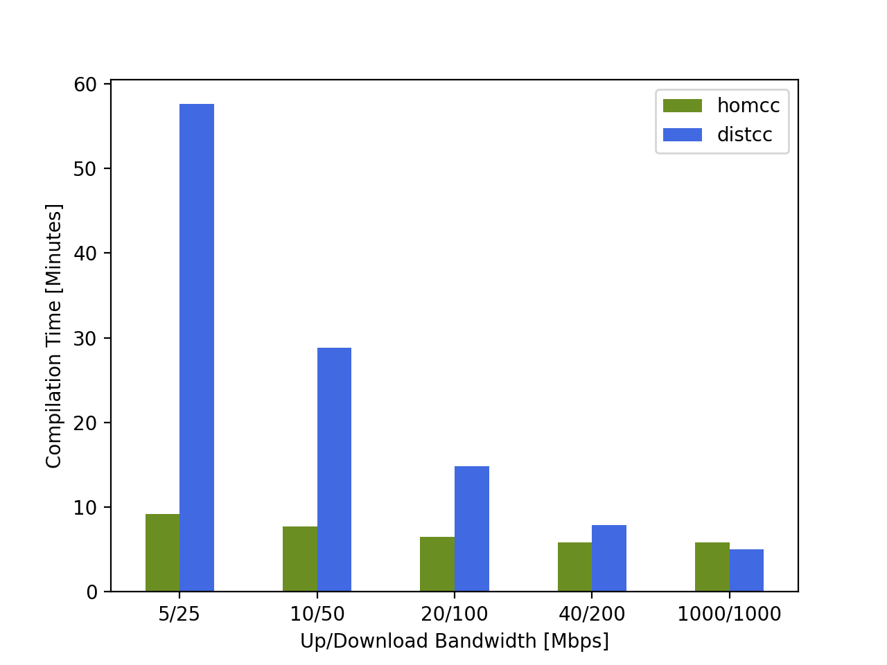

# :house_with_garden: HOMCC - Home-Office friendly distcc replacement

`HOMCC`, pronounced `həʊm siː siː`, is a home-office oriented, compilation distribution project which keeps the premise of always generating the same results as a local build.
Current supported languages are `C` and `C++` with their respective `gcc` and `clang` compilers.

While distributing compilations generally improves build times of large code bases, narrow network bandwidths pose a crucial limiting factor.
This project's primary goal is to find approaches to mitigate this bottleneck.
Although `HOMCC` is still in an early stage of development, we can already see improvements of around 2x compared to alternatives like `distcc`.
<p align="center">
  
  <br/>
  <sub>
  Difference in total remote compilation times for a <a href="https://github.com/celonis/">Celonis</a> internal C++ code base built with <code>g++-8</code>, a total server job limit of 112, an upload rate of 4.0 MiB/s and varying amount of dedicated local threads.
  Note, this plot wrongly still includes negligible local linking times of above 90 seconds.
  </sub>
</p>

The main solution to enable faster compilation times for thinner connections is the compression and `server`-side caching of dependencies.
Due to caching, only missing dependencies are requested from `client`s which drastically decreases the overall network traffic once the cache is warmed up.
Transmitted files like the requested dependencies and also the resulting object files are compressed to further improve build times.
Additionally, `HOMCC` provides sandboxed compiler execution for remote compilations (via `schroot`).

---

## Table of Contents
1. [Installation](#installation)
2. [Usage](#usage)
   1. [Client: `homcc`](#client-homcc)
   2. [Server: `homccd`](#server-homccd)
3. [Configuration](#configuration)
4. [Documentation](#documentation)
5. [Development](#development)
   1. [Setup](#setup)
   2. [Testing](#testing)
   3. [Linting](#linting)
   4. [Formatting](#formatting)
   5. [Build Debian packages](#build-debian-packages)
   6. [`schroot` testing setup for Debian systems](#schroot-testing-setup-for-debian-systems)

---

## Installation
- [Download](https://github.com/celonis/homcc/releases) the latest release or [build](#build-debian-packages) the Debian packages yourself
- Install the `homcc` client via:
  ```sh
  $ sudo apt install ./homcc.deb
  ```
- Install the `homccd` server via:
  ```sh
  $ sudo apt install ./homccd.deb
  ```

- **Note:** Currently, installing both packages leads to an issue with conflicting files. Install the second package via:
  ```sh
  $ sudo dpkg -i --force-overwrite ./{package.deb}
  ```


## Usage

### Client: `homcc`
- Follow the client [Installation](#installation) guide
- Find usage description and `homcc` defaults:
  ```sh
  $ homcc --help
  ```
- Use `homcc` by specifying `CCACHE_PREFIX=homcc` in your `conan` profile or IDE of choice!
- Specify your remote compilation server via the `$HOMCC_HOSTS` environment variable or in a dedicated `hosts` file:<br/>
  <table>
    <tr align="center"><th><code>hosts</code> file locations</th></tr>
    <tr valign="top"><td>
    <code>$HOMCC_DIR/hosts</code><br/>
    <code>~/.homcc/hosts</code><br/>
    <code>~/.config/homcc/hosts</code><br/>
    <code>/etc/homcc/hosts</code>
    </td></tr>
    </table>
- Possible `hosts` formats:
    - `HOST` format:
      - `HOST`: TCP connection to specified `HOST` with default port `3633`
      - `HOST:PORT`: TCP connection to specified `HOST` with specified `PORT`
    - `HOST/LIMIT` format:
      - Define any of the above `HOST` formats with an additional `LIMIT` parameter that specifies the maximum connection limit to the corresponding `HOST`
      - It is advised to always specify your `LIMIT`s as they will otherwise default to 2 and only enable minor levels of concurrency
    - `HOST,COMPRESSION` format:
      - Define any of the above `HOST` or `HOST/LIMIT` format with an additional `COMPRESSION` algorithm information
      - Choose from:
        - `lzo`: Lempel-Ziv-Oberhumer compression algorithm
        - `lzma`: Lempel-Ziv-Markov chain algorithm
      - No compression is used per default, specifying `lzo` is however advised
  <table>
    <tr align="center"><th>Example: <code>hosts</code></th><th>Explanation</th></tr>
    <tr valign="top">
    <td><sub><pre>
    # homcc: hosts
    localhost
    remotehost/12
    192.168.0.1:3633/21
    [FC00::1]:3633/42,lzo
    </pre></sub></td>
    <td><sub><pre>
    # Comment
    "localhost" host with default limit of 2
    Named "remotehost" TCP host with limit of 12 at default port 3633
    IPv4 "192.168.0.1" TCP host at port 3633 with limit of 21
    IPv6 "FC00::1" TCP host at port 3633 with limit of 42 and lzo compression
    </pre></sub></td>
    </tr>
  </table>


### Server: `homccd` 
- Follow the server [Installation](#installation) guide
- Find usage description and server defaults:
  ```sh
  $ homccd --help
  ```
- \[Optional] Sandboxed execution:
  - `schroot`: Set up your `schroot` environments at `/etc/schroot/schroot.conf` or in the `/etc/schroot/chroot.d/` directory and mount the `/tmp/` directory to enable sandboxed compiler execution.
  Currently, in order for these changes to apply, you have to restart `homccd`:
    ```sh
    $ sudo systemctl restart homccd.service
    ```
  - `docker`:
    - Make sure that the docker containers that you want to compile in have mounted the host's `\tmp` directory to `\tmp` (this is necessary to access cached dependencies):
      ```sh
      $ sudo docker run --name example_container -v /tmp:/tmp  -it ubuntu:22.04
      ```
    - Make sure the docker containers you want to compile in are running and have the appropriate compilers installed
    


## Configuration
- Overwrite defaults globally via a `homcc.conf` configuration file:
  <table>
    <tr align="center"><th><code>homcc.conf</code> file locations</th></tr>
    <tr valign="top"><td>
    <code>$HOMCC_DIR/homcc.conf</code><br/>
    <code>~/.homcc/homcc.conf</code><br/>
    <code>~/.config/homcc/homcc.conf</code><br/>
    <code>/etc/homcc/homcc.conf</code>
    </td></tr>
  </table>
- :exclamation: Explicit configuration is currently not necessary, only do this if you know exactly what you are doing!
  <table>
    <tr align="center"><th>Example: <code>homcc.conf</code></th><th>Explanation</th></tr>
    <tr valign="top">
    <td><sub><pre lang="ini">
    [homcc]
    compiler=g++
    timeout=60
    compression=lzo
    profile=jammy
    docker_container=example_container
    log_level=DEBUG
    verbose=True
    [homccd]
    limit=64
    port=3633
    address=0.0.0.0
    log_level=DEBUG
    verbose=True
    </pre></sub></td>
    <td><sub><pre>
    # Client configuration
    Default compiler
    Default timeout value in seconds
    Default compression algorithm: {lzo, lzma}
    Profile to specify the schroot environment for remote compilations
    Docker container that should be used on the server for remote compilations
    Detail level for log messages: {DEBUG, INFO, WARNING, ERROR, CRITICAL}
    Enable verbosity mode which implies detailed and colored logging
    # Server configuration
    Maximum limit of concurrent compilations
    TCP port to listen on
    IP address to listen on
    Detail level for log messages: {DEBUG, INFO, WARNING, ERROR, CRITICAL}
    Enable verbosity mode which implies detailed and colored logging
    </pre></sub></td>
    </tr>
  </table>


## Documentation
- Terms: `HOMCC` generally refers to the whole project while the terms `homcc` and `client` as well as `homccd` and `server` can be used interchangeably.
  However, for user facing context `homcc[d]` is preferred whereas `client` & `server` should be used internally.
- TODO:
  - Client: Preprocessing, Hosts Parsing & Selection
  - Communication: `HOMCC` Message Protocol
  - Server: Caching, Profile Parsing


## Development

### Setup
- Install the `liblzo2-dev` apt package (needed for LZO compression):
  ```sh
  $ sudo apt install liblzo2-dev liblzma-dev
  ```
- Install required dependencies:
  ```sh
  $ python -m pip install -r requirements.txt
  ```


### Testing
- Tests and test coverage analysis are performed via [pytest](https://github.com/pytest-dev/pytest)
- Execute all default tests in `./tests/` and perform test coverage:
  ```sh
  $ pytest -v -rfEs --cov=homcc
  ```
- \[TEMPORARY]: View all `homcc` semaphores:
  ```sh
  $ cat /dev/shm/sem.homcc* | xxd -p -c 32
  ```


### Linting
- Analyze all `python` files with [pylint](https://github.com/PyCQA/pylint):
  ```sh
  $ pylint -v --rcfile=.pylintrc *.py homcc tests
  ```
- Check static typing of all `python` files with [mypy](https://github.com/python/mypy):
  ```sh
  $ mypy --pretty *.py homcc tests
  ```


### Formatting
- Formatting and format check are executed via [black](https://github.com/psf/black)
- Check the formatting of all `python` files and list the required changes:
  ```sh
  $ black --check --color --diff --verbose *.py homcc tests
  ```

### Build Debian packages
- Install required tools:
  ```sh
  $ sudo apt install -y \
    python3 python3-dev python3-pip python3-venv python3-all \
    dh-python debhelper devscripts dput software-properties-common \
    python3-distutils python3-setuptools python3-wheel python3-stdeb \
    liblzo2-dev
  ```
- Run `sudo make homcc`, `sudo make homccd` or `sudo make all` to build the corresponding `client` and `server` package
- The generated `.deb` files are then contained in the `./target/` directory


### `schroot` testing setup for Debian systems
- Install required tools:
  ```sh
  $ sudo apt install schroot debootstrap
  ```
- Create `schroot` environment:
  - Download and install selected distribution to your desired location, e.g. `Ubuntu 22.04 Jammy Jellyfish` from [Ubuntu Releases](https://wiki.ubuntu.com/Releases) at `/var/chroot/`:
    ```sh
    $ sudo debootstrap jammy /var/chroot/jammy http://archive.ubuntu.com/ubuntu
    ```
  - Configure the environment by creating a corresponding file in the `/etc/schroot/chroot.d/` directory or by appending an entry to `/etc/schroot/schroot.conf`, e.g. by replacing `USERNAME` for `jammy.conf`:
    ```ini
    [jammy]
    description=Ubuntu 22.04 Jammy Jellyfish
    directory=/var/chroot/jammy
    root-users=USERNAME
    users=USERNAME
    type=directory
    ```
- Verify that a `jammy` entry exists:
  ```sh
  $ schroot -l
  ```
- Install missing `build-essential`s in the new environment (currently only `g++` is needed):
  ```sh
  $ sudo schroot -c jammy -- apt -y install build-essential
  ```
- Execute *schrooted* compilations by specifying `--profile=jammy` via the CLI or in the `client.conf` file
- Execute all tests in `./tests/` and perform test coverage:
  ```sh
  $ pytest -v -rfEs --cov=homcc --runschroot=jammy
  ```
