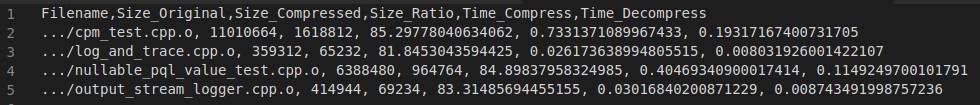
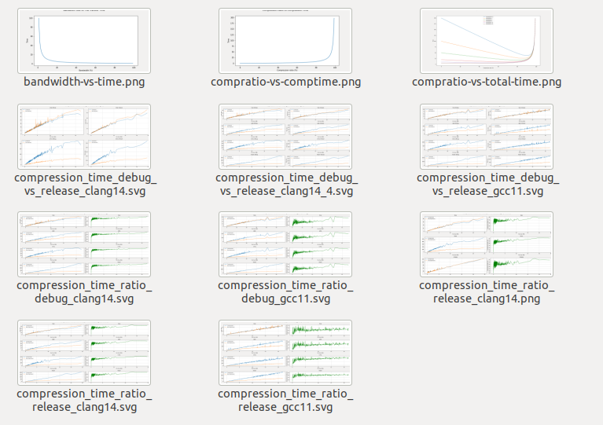

# Object File Compression Analysis

This repository contains some useful tools for analysing the timewise/sizewise efficiency of different compression algorithms.
For further questions, a.mirza@celonis.com

## Usage

The scripts in this repository can be used to generate benchmarks (`benchmark.py`) and visualize them (`visualizer.ipynb`).
Both of them work relative to the directory they are located in and they will read and write relative to that, unless stated otherwise.

### Benchmarking (main.py)

    python3 benchmark.py --dir <object-files-directory> --mode <compilation-mode> --level <compression-level> --compiler <compiler> --algorithm <compression-algorithms>

- **object-files-directory**: Absolute path of the folder containing the compiled `.o` files. This is not relative to the current working directory.
- **compilation-mode**: `debug` or `release`. This parameter affects the naming of the generated csv files, so make sure to provide the object-files-directory corresponding to the compilation mode.
- **compression-level**: Compression level flag for the compression algorithm. Some implementations (e.g. snappy) ignore this flag.
- **compiler**: `clang14` or `gcc11`. This parameter only affects the naming of the generated csv files, so make sure to provide the corresponding files.
- **compression-algorithm**:`lzop`, `lzma`, `lz4`, `gzip`, `bzip2` or `snappy`. If multiple algorithms are provided, separate them by spaces.

The script will recursively traverse the given directory, compress and then decompress every object file it finds. Then it will prepare a report in the form of a `csv` file containing the original file size, size after compression, compression ratio (calculated as `100 * (old_size - new_size) / old_size`), time needed for compression, and time needed for decompression. 

The script uses `--keep` and `--force` flags by default, so the original files will not be altered and there is no clean-up needed before running it again (existing files will be forced to be recompressed).

#### Example usage

    python3 benchmark.py --dir="/home/arinmirza/Desktop/RELEASE_object_files_gcc11" --mode="RELEASE" --level=1 --compiler="gcc11" --algorithm lzop lzma snappy

### Analysis (visualizer.ipynb)

Use the ipython notebook for analysing the results of the generated benchmark data by using the main script. Plots generated by the visualizer.ipynb will be saved under `./plots/`. 

#### Example plots

## Results

TBD
